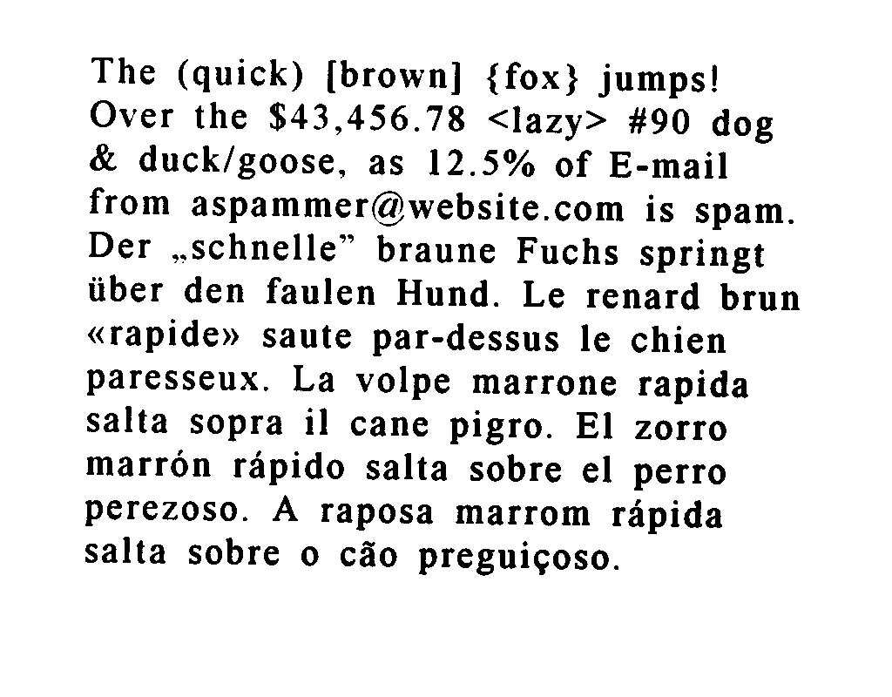

# PDF-Image Highlighter
I am making a highlighter for a group of image in a PDF file. It is a long journey.

### Prerequisites
* Install Google tesseract in your PC. Follow the installation tutorial [here](https://github.com/tesseract-ocr/tesseract/wiki#installation). I am using `tesseract` with configuration `--psm 3 --oem 1` (**LSTM model** and made for **small text detection**). To install `tesseract` in Ubuntu machine:
````
sudo apt install tesseract-ocr
sudo apt install libtesseract-dev
````
* Python 3.x.
* You will need to install `pillow`, `pytesseract`, `pdf2image` and `textdistance`.
````
pip install pillow
pip install pytesseract
pip install pdf2image
pip install textdistance
````
### Example #1: Detect and read the text.

I made some example! I placed my example files in `example` directory. First, change your active directory to `example`.
````
cd example
````

After that, run this command:
````
# python example.py <image_file>
python example.py textimage2.png
````

You will get the result (*shortened version*):


````
The text extraction result is: 
Attn: Pearlene Then
Sub-BU: Technology Department - PUBO9
To: Public Utilities Board
Accounts Payable Section, Finance Department,
...

Data: 
5;1;1;1;1;1;6;22;35;13;93;Attn:
5;1;1;1;1;2;49;22;68;13;92;Pearlene
5;1;1;1;1;3;122;22;39;13;96;Then
5;1;1;1;2;1;7;43;64;13;90;Sub-BU:
...
````

### Example #2: Highlight text in an image
In this example, I am trying to highlight a spesific text inside an image. Do the following steps to try it:
1. You can specify the text that you want to search in the image by changing the `soe` variable located at line 128 on `process.py`. Feel free to change `soe` value. By default, i put my `soe` with some sentences like **salta** and **El zorro**. That means, I want to search those sentences inside the given image.
````
soe = ["salta","El zorro"]
````
2. Run `process.py` followed by the path of the image that you want to detect.
````
# python process.py <image_path>
python process.py example/textimage.png
````

3. You will see the result of text detection process according to the sentences that you put inside `soe`.


### My upcoming updates
My next plan for this project is:
* Read pdf file, convert it to a pile of images and detect the defined soe texts inside it.
* I planned to make a web service from this project by using Flask.